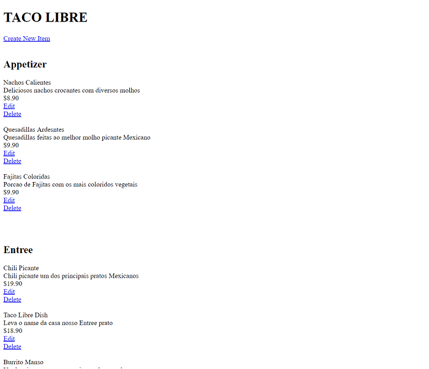

# Restaurant-Menu WebApp

> Webapp to manage restaurants and menus



For this task, I created a WebApp that manage restaurant menus. This reporting tool is a Python program using the `sqlalchemy` module to manage and connect  to the database `sqlite` and `flask` to manage the pages. This task has the following features:

1. Add, edit and delete restaurants and commit in database
2. Add, edit and delete restaurants-menus and commit in database


### REQUIREMENTS

1. Python 3.7.2
2. sqlalchemy
3. flask 1.0.2


## Development setup

1. Donwload and Install Python 3.7 [link](https://www.python.org/downloads/release/python-372/)

2. Install all needed Python modules

```sh
pip install flask 1.0.2
```

```sh
pip install sqlalchemy
```


#### RUNNING THE PROGRAM

1. Create database and tables running
```sh
python database_setup.py
```

2. Fill the database running
```sh
python addrestaunrats.py
```

3. Access your browser in <http://localhost:5000/>


## Usage example

When you run the program, you can view the list of restaurants, edit, and delete them. Just like restaurants menus items can be created, edited and deleted.

_If you find some bugs, problems you can send a message to me [twitter] or [email]._

## Release History

* 0.2.1
   * README file updated.
* 0.2.0
   * Great update on the code new features and more.
* 0.1.0
   * First version.

## Meta

This program is heavily inspired by [Udacity class exercise](https://www.udacity.com/course/intro-to-backend--ud171)

Pedro Carvalho – [@PedrArch](https://twitter.com/PedroArch) – pedrofrancocarvalho@gmail.com

Distributed under the MIT license. See [LICENSE](LICENSE) for more information.

[https://github.com/PedroArch](https://github.com/PedroArch/)

## Contributing

1. Fork it (<https://github.com/PedroArch/restaurant-menu2/fork>)
2. Create your feature branch (`git checkout -b feature/fooBar`)
3. Commit your changes (`git commit -am 'Add some fooBar'`)
4. Push to the branch (`git push origin feature/fooBar`)
5. Create a new Pull Request

<!-- Markdown link & img dfn's -->
[twitter]:https://twitter.com/PedroArch
[github]:https://github.com/PedroArch
[email]: pedrofrancocarvalho@gmail.com
